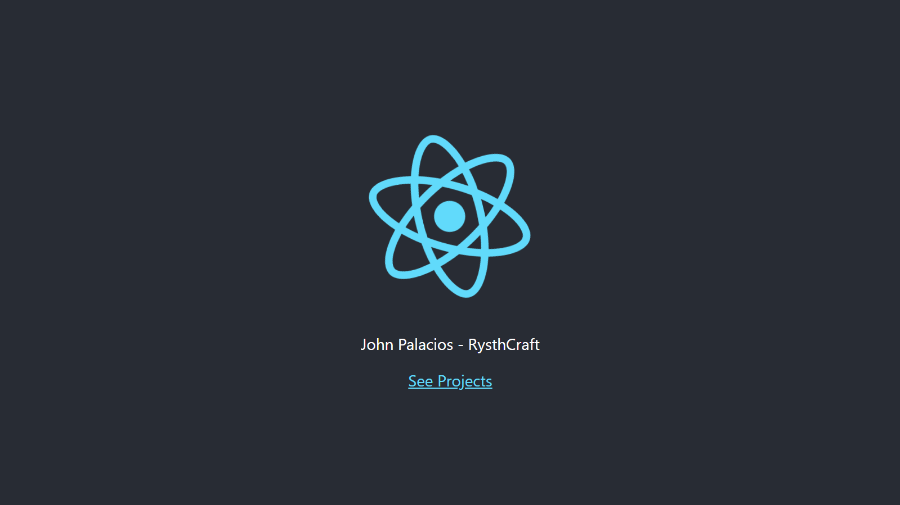

<a name="readme-top"></a>

<div align="center">
  
  <br/>
  <h3><b>John Palacios - RysthCraft</b></h3>
</div>

<!-- TABLE OF CONTENTS -->

# 📗 Table of Contents

- [📖 About the Project](#about-project)
  - [🛠 Built With](#built-with)
    - [Tech Stack](#tech-stack)
    - [Key Features](#key-features)
  - [🚀 Live Demo](#live-demo)
- [💻 Getting Started](#getting-started)
  - [Setup](#setup)
  - [Test](#test)
- [👥 Authors](#authors)
- [🤝 Contributing](#contributing)
- [⭐️ Show your support](#support)
- [🙏 Acknowledgements](#acknowledgements)
- [📝 License](#license)

<!-- PROJECT DESCRIPTION -->

# 📖 REACT Math Magicians <a name="about-project"></a>

- **⌛ Coming soon.**

## 🛠 Built With <a name="built-with"></a>

### Tech Stack <a name="tech-stack"></a>

<details>
  <summary>Client</summary>
  <ul>
    <li><a href="https://www.w3schools.com/html/">HTML</a></li>
    <li><a href="https://www.w3schools.com/css/">CSS</a></li>
    <li><a href="https://www.w3schools.com/js/">JavaScript</a></li>
  </ul>
</details>

<!-- Features -->

### Key Features <a name="key-features"></a>

- **⌛ Coming soon.**

<p align="right">(<a href="#readme-top">back to top</a>)</p>

## 🚀 Live Demo <a name="live-demo"></a>

<div align="center">
  <p><b>Design Preview</b></p>
  
</div>

### Take a Look

- [Live Demo Link](https://rysth.github.io/REACT-Math-Magicians/)

<p align="right">(<a href="#readme-top">back to top</a>)</p>

## 💻 Getting Started <a name="getting-started"></a>

To get a local copy up and running, follow these steps.

### Setup

Clone this repository to your desired folder:

```
git clone https://github.com/Rysth/REACT-Math-Magicians
cd REACT-Math-Magicians
code . (To open VS Code Editor)
```

Then, you will change everything you want!

### Test

In order to follow the Linters you could check them using this:

```
HTML Checker:
npx hint .

CSS Checker:
npx stylelint "**/*.{css,scss}"

JavaScript Checker:
npx eslint .
```

#### Note

Use at the end '--fix' to help you out with any error.

## 👥 Authors <a name="authors"></a>

👤 **John Palacios**

- GitHub: [@rysth](https://github.com/Rysth)

<p align="right">(<a href="#readme-top">back to top</a>)</p>

## 🤝 Contributing <a name="contributing"></a>

Contributions, issues, and feature requests are welcome!

Feel free to check the [issues page](../../issues/).

<p align="right">(<a href="#readme-top">back to top</a>)</p>

## ⭐️ Show your support <a name="support"></a>

If you like this project feel free to watch it and take some features that will enhance your project
as well.

<p align="right">(<a href="#readme-top">back to top</a>)</p>

## 🙏 Acknowledgments <a name="acknowledgements"></a>

I would like to thank the Microverse Team for reviewing my code and making me a better
professional.

Also, I'm grateful to [Cindy Shin in Behance](https://www.behance.net/adagio07) to share with us her design.
Thank you so much!

<p align="right">(<a href="#readme-top">back to top</a>)</p>

## 📝 License <a name="license"></a>

This project is [MIT](./LICENSE.md) licensed.

<p align="right">(<a href="#readme-top">back to top</a>)</p>
